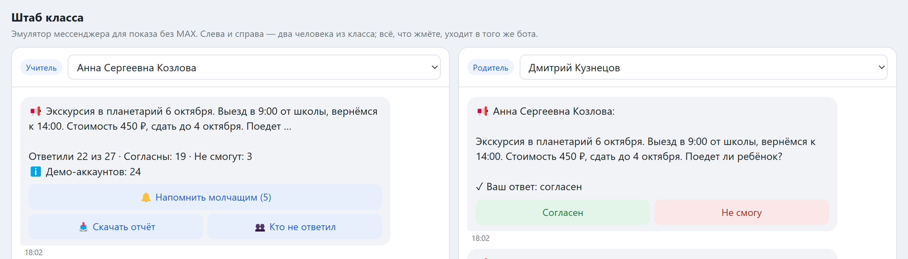
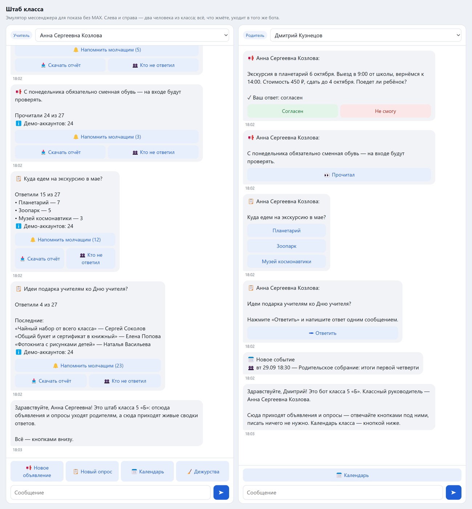

# Штаб класса

Бот для классного руководителя (трек "Упрости работу учителя"). Учитель кидает объявление или опрос,
родители жмут кнопки, а у учителя одно сообщение-сводка, которое само обновляется:

```
Ответили 21 из 27 · Согласны: 18 · Не смогут: 3
```

Считать плюсики в чате больше не надо.



Что умеет: объявления ("Прочитал" или "Согласен / Не смогу"), опросы (да/нет, варианты, свободный ответ),
"Напомнить молчащим" - уходит только тем, кто не ответил, "Кто не ответил" - список имён, календарь
с дежурствами и напоминаниями за день и за час, отчёт в CSV прямо в чат. Двойной клик или одновременные
нажатия дублей не дают, сводка всегда считается из базы.

## Запуск

Нужен JDK 21, gradle ставить не надо.

```
./gradlew test
./gradlew bootRun
```

Без настроек бот никуда не подключается и просто пишет в лог. База H2 в `./data/shtab.mv.db`, схема через Flyway.

### Эмулятор (так и показываем)

Бота в MAX нам пока не выдали, поэтому показываем через эмулятор. Это тот же бот, просто вместо
мессенджера страница в браузере.

```
./gradlew bootRun --args='--spring.profiles.active=seed,emulator'
```

Дальше http://localhost:8080/emulator/ - слева учитель, справа родитель, кого показывать, выбирается сверху.
Засеян демо-класс на 27 семей: 3 родителя "живые", за них можно жать кнопки, остальные 24 - демо-аккаунты,
им бот ничего не шлёт. База у эмулятора своя (`./data/emulator`), переписка только в памяти.
Авторизации нет, это только для локального показа.



### MAX

Когда будет бот: скопировать `application-local.yml.example` в `application-local.yml`, вписать
`max.enabled` и `max.token`. id телефонов видно в логе (строка "пишет незнакомый пользователь"), их прописать
в `seed.teacher-id` и `seed.parent-ids`. Есть ещё VK как запасной (`vk.enabled`), включать что-то одно.

### Docker

```
docker build -t shtab-klassa .
docker run -d --name shtab -e MAX_ENABLED=true -e MAX_TOKEN=<токен> \
  -e SPRING_PROFILES_ACTIVE=seed -e SEED_TEACHERID=<id учителя> -e SEED_PARENTIDS=<id1>,<id2> \
  -v shtab-data:/app/data shtab-klassa
```

Можно и без докера: `./gradlew bootJar`, потом `java -jar build/libs/shtab-klassa.jar` с теми же параметрами.

На винде winget не прописывает JAVA_HOME, надо руками:

```powershell
[Environment]::SetEnvironmentVariable("JAVA_HOME", "C:\Program Files\Eclipse Adoptium\jdk-21.0.12.101-hotspot", "User")
```

PostgreSQL вместо H2 - через `application-local.yml`, пример там же. Версии библиотек в `requirements.txt`.

## Демо, шпаргалка

1. учитель: сводка по экскурсии, 21 из 27. сразу сказать, что 24 родителя демо и в сводке они отдельной строкой
2. родитель справа жмёт Согласен - у него под объявлением "✓ Ваш ответ", у учителя 22 из 27
3. ещё раз Согласен - "Уже отмечено", цифры стоят. Не смогу - ответ меняется
4. учитель: Кто не ответил - список имён, второй клик без дубля
5. Напомнить молчащим - прилетает второму родителю, второй клик - "Уже напомнили" (в эмуляторе пауза 30 сек)
6. Скачать отчёт - csv, открыть в экселе, молчащие сверху
7. если есть время: опрос с вариантами, календарь, событие на +61 мин

## Приватность

Храним минимум: id в мессенджере, имя, роль, класс, у ученика ссылка на родителя (чтобы напоминать про
дежурство). Оценок, здоровья, конфликтов, дисциплины нет вообще. Родитель видит только свой ответ и дежурства
своего ребёнка, чужих ответов и цифр по классу у него нет. Сводки, список молчащих и отчёт получает только
классный руководитель. Удаление и анонимизация ученика пока не сделаны, заготовка в `core/security/StudentDataEraser`.

## Как устроено

Логика в `service`, `bot/handler` только раскидывает события. Транспорт спрятан за `MessageSender`:
MAX, VK, эмулятор и заглушка в лог. Напоминания на Quartz в памяти, при старте пересоздаются из базы.
Тестов около 200: клики и гонки, обрыв long poll, CSV, дежурства, напоминания.

## Что не успели

- адаптеры MAX и VK проверены только на MockWebServer, живьём нет
- часовой пояс зашит (Москва), праздники не учитываются
- черновики и ожидание ответа в памяти, после рестарта начинать заново
- напоминание, которое выпало на простой приложения, не придёт
